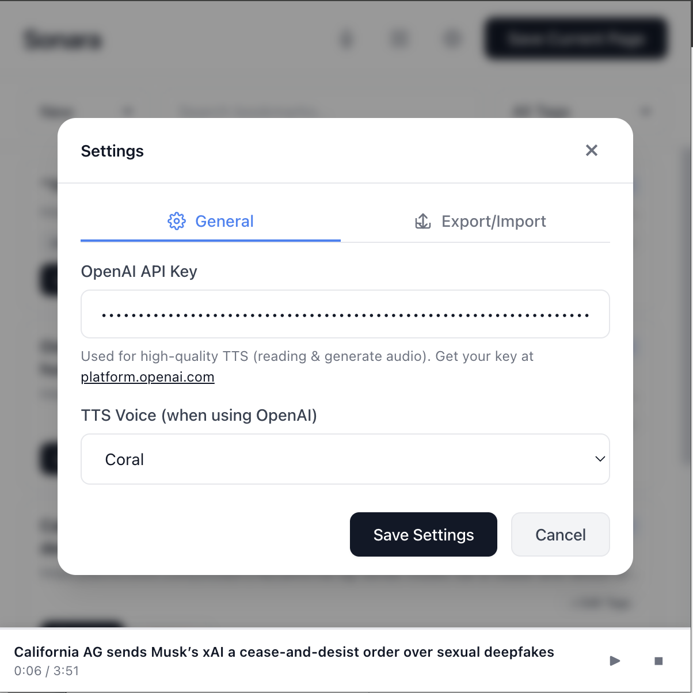

<p align="center">
  
</p>

<h1 align="center">Sonara</h1>

<p align="center">
  <strong>Save articles. Listen anywhere.</strong>
  <br>
  A Chrome extension that saves articles and reads them to you with AI-powered voices.
</p>

<p align="center">
  
  
  
  
</p>

<p align="center">
  
</p>

---

## Features

### 📚 Save & Organize

| Feature | Description |
|---------|-------------|
| **One-click save** | Save any article instantly from any website |
| **Clean extraction** | Automatically removes ads, sidebars, and clutter |
| **Tags** | Organize articles with custom tags |
| **Search** | Find articles by title, URL, or tags |
| **Archive** | Mark articles as done to keep your list tidy |
| **Edit content** | Edit article text and regenerate audio |

### 🎧 Listen with AI Voices

<p align="center">
  
</p>

| Feature | Description |
|---------|-------------|
| **13 AI voices** | High-quality OpenAI TTS voices (Alloy, Coral, Nova, etc.) |
| **Auto-generate** | Audio creates automatically when you save |
| **Background play** | Keep listening while browsing other tabs |
| **Download audio** | Save MP3 files for offline listening |
| **Custom audio** | Create audio from any text—no webpage needed |
| **Playback speed** | Adjust speed from 0.5x to 2x |

### 📝 Highlights

<p align="center">
  
</p>

- **Save quotes**: Select and save important passages from articles
- **All in one place**: View all your highlights across articles
- **Quick access**: Jump back to any article from your highlights

### ⚙️ Settings & Data

<p align="center">
  
</p>

- **Voice selection**: Choose from 13 OpenAI voices
- **Export/Import**: Transfer your data between computers
- **Works offline**: Browser TTS fallback when API is unavailable

---

## Quick Start

### 1. Install

```bash
# Clone or download this repository
git clone https://github.com/your-username/Sonara.git
```

Then in Chrome:
1. Go to `chrome://extensions/`
2. Enable **Developer mode** (top right)
3. Click **Load unpacked**
4. Select the Sonara folder

### 2. Setup (Optional)

For high-quality AI voices:
1. Click the Sonara extension icon
2. Open Settings (⚙️ icon)
3. Add your [OpenAI API key](https://platform.openai.com/api-keys)
4. Choose your preferred voice

> **Note:** Sonara works without an API key using your browser's built-in voices, but OpenAI voices sound significantly better.

### 3. Save Your First Article

1. Visit any article on the web
2. Click the Sonara extension icon
3. Click **Save Current Page**
4. Add tags if you want
5. Click **Save**

Audio generates automatically. Click **Listen** when ready! 🎧

---

## Usage Guide

### Saving Articles

| Action | How |
|--------|-----|
| Save current page | Click extension → **Save Current Page** |
| Add tags | Enter comma-separated tags when saving |
| Edit tags later | Click **+ Edit Tags** on any article |

### Listening

| Action | How |
|--------|-----|
| Play article | Click **🎧 Listen** or click the article |
| Controls | Play, Pause, Stop, Seek, Speed adjustment |
| Background play | Audio continues when popup closes |
| Download | Click download icon to save MP3 |

### Creating Custom Audio

1. Click the microphone icon (🎙️) in the header
2. Enter a title and paste your text
3. Click **Generate Audio**
4. Listen when ready

### Highlighting Text

1. Open any saved article
2. Select text you want to save
3. Click **💾 Save Highlight**
4. View all highlights via the 📑 icon

### Organizing

| Filter | Description |
|--------|-------------|
| **New** | Unread articles (default) |
| **All** | Everything |
| **Archived** | Articles you've finished |
| **By Tag** | Filter by specific tag |

### Export & Import

**Export:** Settings → Export/Import tab → Export Data  
**Import:** Settings → Export/Import tab → Choose File to Import

Options:
- Include/exclude audio files (can make exports 100MB+)
- Include/exclude API key (not recommended for security)

---

## Privacy

| | |
|---|---|
| 🔒 **100% Local** | All data stays in your browser |
| 🚫 **No Tracking** | We don't collect any information |
| 💾 **Your Data** | Everything stored locally on your device |
| 🔑 **Optional API** | API key only used for OpenAI TTS requests |

---

## Technical Details

### Architecture

- **Manifest V3** Chrome extension
- **Vanilla JavaScript** - No frameworks
- **Chrome Storage API** - Settings and article metadata
- **IndexedDB** - Large audio files (avoids Chrome storage quotas)
- **Service Worker** - Background audio generation
- **Offscreen Document** - Background audio playback

### File Structure

```
Sonara/
├── manifest.json              # Extension manifest (MV3)
├── popup.html/js/css          # Main popup UI
├── offscreen.html             # Background audio playback
├── assets/
│   └── icons/                 # Extension icons
├── src/
│   ├── background/
│   │   └── service-worker.js  # Background service worker
│   ├── content/
│   │   └── article-extractor.js  # Content script for article extraction
│   ├── offscreen/
│   │   └── audio-player.js    # Offscreen audio player
│   ├── popup/
│   │   ├── components/        # Reusable UI components
│   │   │   └── audio-player.js
│   │   └── views/             # View handlers (settings, modals)
│   │       ├── settings.js
│   │       └── modals.js
│   ├── services/              # Business logic & data layer
│   │   ├── storage.js         # Chrome storage manager
│   │   ├── audio-storage.js   # IndexedDB for audio files
│   │   ├── highlights.js      # Highlights manager
│   │   └── tts/
│   │       ├── openai-tts.js  # OpenAI TTS API
│   │       └── browser-tts.js # Browser TTS fallback
│   └── utils/                 # Shared utilities
│       ├── helpers.js         # Common helper functions
│       └── markdown.js        # Markdown rendering
└── docs/                      # Documentation
```

### API Usage

When using OpenAI TTS:
- Model: `gpt-4o-mini-tts`
- Endpoint: `https://api.openai.com/v1/audio/speech`
- Long articles are split into chunks (~4096 chars each)
- Includes retry logic with exponential backoff

---

## Known Issues

| Issue | Details |
|-------|---------|
| **Basic article parsing** | Some complex sites may not extract perfectly. Chrome extension limitations prevent using advanced parsing libraries. |
| **Long article timeout** | Articles over ~10 minutes of audio may timeout. Auto-retries after 10 minutes. |
| **Browser TTS quality** | Without OpenAI API key, browser voices are lower quality. |
| **Large audio files** | Very large files may load slowly. |

---

## Roadmap

- [ ] Improved article extraction
- [ ] Additional TTS providers (ElevenLabs, etc.)
- [ ] Chrome Sync for cross-device access
- [ ] Keyboard shortcuts
- [ ] Batch operations (delete/archive multiple)
- [ ] Reading statistics
- [ ] PDF support
- [ ] Better error messages

---

## Contributing

We welcome contributions! See [CONTRIBUTING.md](CONTRIBUTING.md) for guidelines.

```bash
# Quick start for contributors
git clone https://github.com/your-username/Sonara.git
cd Sonara
# Load extension in Chrome (see install instructions)
# Make changes and test
```

---

## FAQ

<details>
<summary><strong>Do I need an OpenAI API key?</strong></summary>

No! Sonara works with your browser's built-in text-to-speech. However, OpenAI voices sound much more natural. Get a key at [platform.openai.com](https://platform.openai.com/api-keys).
</details>

<details>
<summary><strong>How much does the OpenAI API cost?</strong></summary>

OpenAI TTS is very affordable. A typical article (5-10 minutes of audio) costs about $0.01-0.03. Check [OpenAI pricing](https://openai.com/pricing) for current rates.
</details>

<details>
<summary><strong>Why isn't the article extracting correctly?</strong></summary>

Some sites have complex layouts that confuse the extractor. You can edit the article content after saving to fix any issues.
</details>

<details>
<summary><strong>Can I use this on Firefox/Safari?</strong></summary>

Currently Chrome only. Firefox support may come in the future.
</details>

<details>
<summary><strong>Where is my data stored?</strong></summary>

Everything is stored locally in your browser using Chrome Storage API and IndexedDB. Nothing is sent to any server (except OpenAI when generating audio).
</details>

<details>
<summary><strong>How do I transfer my articles to another computer?</strong></summary>

Use the Export/Import feature in Settings. Export creates a JSON file you can import on another computer.
</details>

---

## License

MIT License - See [LICENSE](LICENSE) for details.

---

<p align="center">
  Made with ❤️ for readers who want to listen
  <br><br>
  <a href="CHANGELOG.md">Changelog</a> · 
  <a href="CONTRIBUTING.md">Contributing</a> · 
  <a href="docs/QUICKSTART.md">Quick Start Guide</a>
</p>
